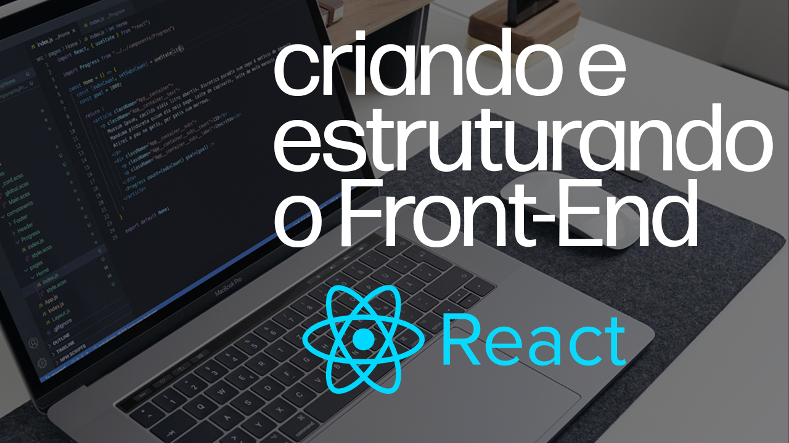

## Contador de Inscritos - Parte 1

As dicas deste Tutorial ReactJS estão separadas em uma série, onde o objetivo final é criar uma página com uma espécie de contador de inscritos e uma barra de progresso que sinaliza a porcentagem de inscritos em relação a meta do canal que atualmente é de 1000 inscritos.

Neste módulo, utilizando o ReactJs daremos inicio ao projeto e ajustar a estruturação inicial de pastas, arquivos e componentes, preparando nosso projeto para seguirmos com o restante do desenvolvimento.

Acompanhe o desenvolvimento com o vídeo abaixo:

Ou acompanhe no formato de texto abaixo: 

